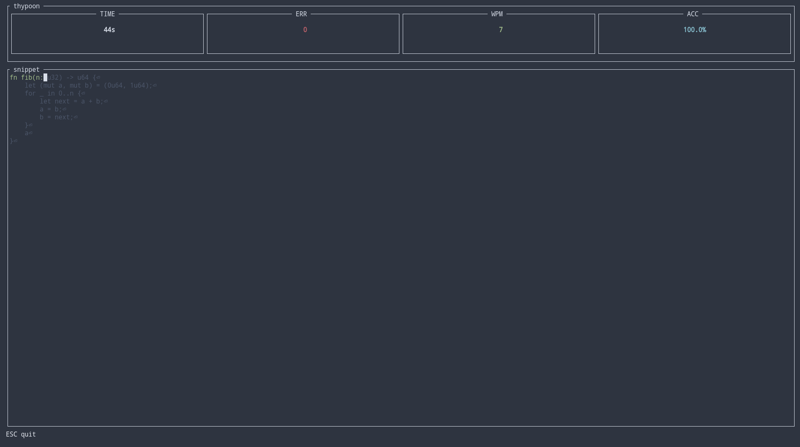

# thypoon

TUI typing trainer for code — practice real Rust, TypeScript, and Go snippets in 60-second timed sessions with live WPM and accuracy feedback.



## Features

- **Three languages** — Rust (`-r`), TypeScript (`-t`), Go (`-g`)
- **60-second timer** — countdown bar, live remaining time
- **Real metrics** — gross WPM, net WPM, accuracy, error count
- **Multi-line snippet view** — centered in terminal, scrolls as you type
- **File-based corpus** — drop `.rs`/`.ts`/`.go` files in `corpus/` to extend

## Installation

```bash
cargo build --release
# binary at target/release/thypoon
```

Requires `THYPOON_CORPUS_DIR` env var pointing to the corpus directory (defaults to `./corpus` when unset — see `FsCorpusRepository::from_env`).

## Usage

```bash
thypoon -r          # Rust
thypoon -t          # TypeScript
thypoon -g          # Go

thypoon --rust
thypoon --typescript
thypoon --go
```

Keys during session:

| Key | Action |
|-----|--------|
| Any printable char | Type |
| `Backspace` | Delete last char |
| `Esc` / `Ctrl-C` | Quit |

## Architecture

Clean onion structure under `src/`:

```
core/
  domain/        — Session, Snippet, Stats, Keystroke, Language
  application/   — StartSession, ProcessKeystroke, Tick use cases
infrastructure/
  corpus/        — FsCorpusRepository (file-based snippet loader)
  clock/         — SystemClock (wall-clock wrapper)
  rng/           — Xorshift64 (no external RNG crate)
presentation/
  cli/           — clap CLI with mutually exclusive language flags
  tui/           — ratatui + crossterm renderer, input handler, TerminalGuard
```

## Tests

```bash
cargo test
```

47 tests total — 43 unit, 4 integration. Integration tests cover corpus loading edge cases and terminal guard partial-init leak.
